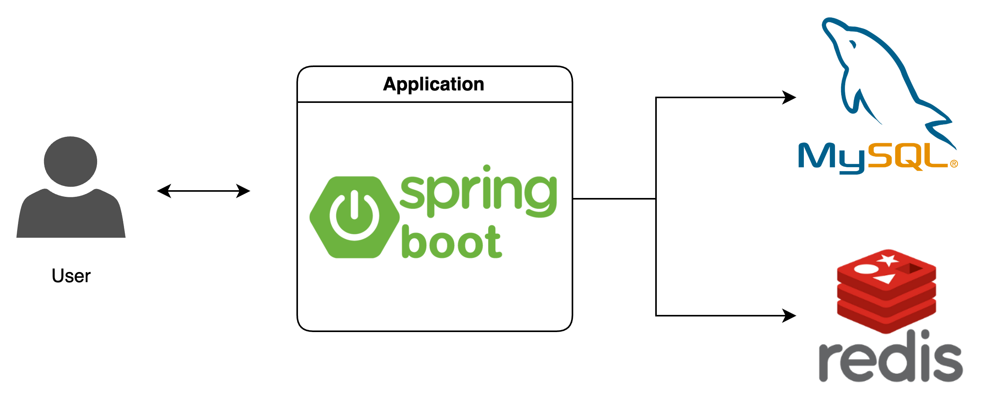
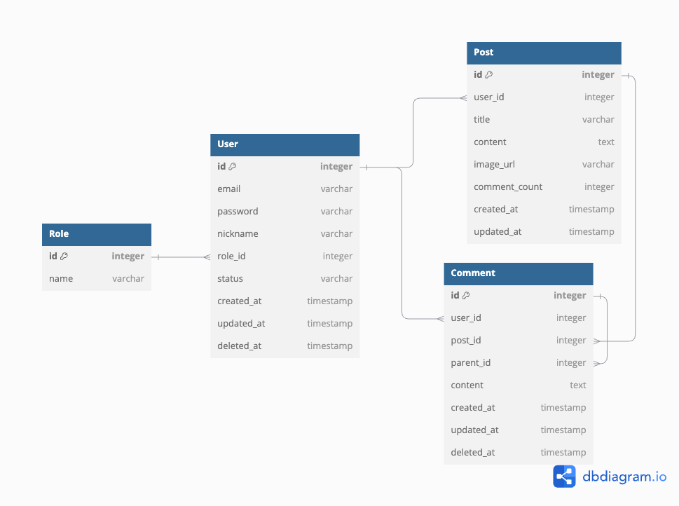

# CommunityBoard

사용자들이 자유롭게 소통할 수 있는 커뮤니티 게시판 서비스입니다.

---

## ⚙ 아키텍쳐

---

## 🗒️ ERD

---

## 🚀 주요 기능

- 이메일 인증을 통해 회원가입 진행 (추가기능-소셜로그인)(추가기능-관리자)
- JWT를 활용한 인증/인가 로직 구현
- 로그인/로그아웃에 따른 편집 허가 기능 구현
- 게시글 관리 (게시글 작성/조회/작성한 게시글 편집) (추가기능-이미지 추가)
- 댓글 관리 (댓글 작성/조회/작성한 댓글 편집) (추가기능-대댓글)
- 게시글 검색 기능

---

## 🛠️ 기술 스택

 
    
     
     
    
     
    
    
    
     

